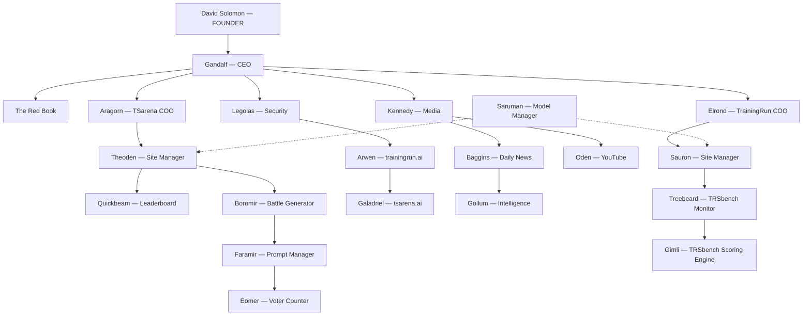

# TR2 Full Operational Structure

> **Version:** V5.0 — March 12, 2026
> **Status:** Final — approved by David
> **Purpose:** Single source of truth for every agent, process, loop, and cadence that powers TrainingRun 2.0 (TrainingRun.AI + TS Arena)
> **Companion doc:** TR2 Process Map (detailed step-by-step workflows per agent — separate document)

### Changelog

| Version | Date | Changes |
|---|---|---|
| V1.0 | March 10, 2026 | Initial draft — hierarchy, Core 10, autonomy levels, loop standard, agent registry |
| V2.0 | March 10, 2026 | Added: Daily Huddle Cascade (management operating system), LOOP.md Karpathy-native templates with phased research plans, Primary Success Metric per agent, Risks & Guardrails section, "What must change" migration details for all carry-over agents, Mermaid diagram, Telegram bot renames, cost monitoring agent, tmux runtime preference, swarm vision (Phase 5), transfer testing requirement for L4 |
| V3.0 | March 10, 2026 | Final polish: Reduced Telegram to 2 bots only (Gandalf + Kennedy) — all other agents communicate via huddle cascade. Fixed cost scraper ownership (Gandalf owns cost_monitor.py, not Gimli). Added "After 10 experiments: write mini-paper to The Red Book" to all 3 LOOP.md agent examples for consistency with template. Updated escalation chain, human override, and confidence thresholds to reflect 2-bot Telegram model. |
| V4.0 | March 10, 2026 | Unified TrainingRun.AI leaderboard: ONE TRSbench leaderboard with subcategories (TRUscore, TRFcast, TRScode, TRAgents, TSarena weight) replacing separate pillar pages. Updated Treebeard role to TRSbench monitor. Clarified Gimli feeds single bench. Fixed Theoden Telegram entry. Adopted 2026.03.10.HHMM naming convention. |
| V5.0 | March 12, 2026 | **Migration progress:** Gimli branded and live as unified_ddp.py (one monolithic DDP script, NOT the 5 separate agent_*.py files shown in V4). Baggins (Daily News) migrated from trainingrun-site to TR2 — running from `agents/daily-news/`, launchd plist swapped. Gollum (Content Scout) migrated from trainingrun-site to TR2 — running from `agents/content-scout/`, verified 279 items from 21 sources. Avatar images added for Gimli, Baggins, Gollum, Kennedy in `assets/`. News.html live with 11 published articles. 37/37 methodology source links verified. Three LEARNING docs created (001-cron-git-push-auth, 002-index-html-cutover, 003-source-link-integrity). Core 10 vault files (LOOP.md, MEMORY-PROTOCOL.md, AUTONOMY-RULES.md) created for Baggins and Gollum. Directory rename from daily-news→baggins and content-scout→gollum pending (code working first, rename later). |

---

## Section 1: Company Hierarchy



```
David Solomon — FOUNDER
│
└── Gandalf — CEO AGENT
    │
    ├── The Red Book (Knowledge Base)
    │
    ├── Aragorn — TSarena COO [AGENT]
    │   └── Theoden — Site Manager [AGENT]
    │       ├── Quickbeam — Leaderboard [SUB AGENT]
    │       └── Boromir — Battle Generator [AGENT]
    │           └── Faramir — Prompt Manager [SUB AGENT]
    │               └── Eomer — Voter Counter [PYTHON SCRIPT]
    │
    ├── Legolas — Security [AGENT]
    │   └── Arwen — trainingrun.ai [SUB AGENT]
    │       └── Galadriel — tsarena.ai [SUB AGENT]
    │
    ├── Kennedy — Media [AGENT]
    │   ├── Baggins — Daily News / The Journalist [AGENT]
    │   │   └── Gollum — Intelligence Gatherer [SUB AGENT]
    │   └── Oden — YouTube [AGENT]
    │
    └── Elrond — TrainingRun COO [AGENT]
        └── Sauron — Site Manager [AGENT]
            └── Treebeard — TRSbench Monitor [SUB AGENT]
                └── Gimli / TRSbench — Scoring Engine [PYTHON SCRIPT]
                    │
                    TRSbench = ONE unified leaderboard with subcategories:
                    ├── TRUscore (Truth) — subcategory
                    ├── TRFcast (Prediction) — subcategory
                    ├── TRScode (Coding) — subcategory
                    ├── TRAgents (Agentic Behavior) — subcategory
                    └── TSarena weight — subcategory

Saruman — Model Manager [AGENT] (cross-functional: serves both Theoden + Sauron)
```

**Key principles:**
- David is the founder. He does not write code. He approves, directs, and sets vision.
- Gandalf (CEO Agent) is the office — he runs the company through daily huddles with his four directors.
- Each site has a COO (Aragorn for TS Arena, Elrond for TrainingRun) and a Site Manager underneath.
- Agents think and learn. Sub Agents execute specialized tasks within a parent's scope. Python Scripts are deterministic — no AI reasoning, just computation.
- Problems are solved at the lowest possible level. Only what can't be solved escalates up through the daily huddle. Every level is constantly improving the autonomy and capability of the people below.
- Saruman is the one exception — cross-functional, serves both site managers with dashed-line reporting.

---

## Section 2: The Daily Huddle Cascade — Management Operating System

This is the heartbeat of TR2. Every level of the org chart has a daily huddle. Problems get pushed down to the lowest level capable of solving them. When they can't be solved, they escalate up through the huddle chain. The system constantly improves the autonomy and acumen of agents at every level.

### Huddle Structure

```
DAILY HUDDLE CASCADE

David (Founder)
  └── Reviews Gandalf's MORNING_CONTEXT.md at wake-up
      Only intervenes on founder-level decisions

Gandalf (CEO) huddles daily with:
  ├── Aragorn (TSarena COO)     — "What can't your team solve?"
  ├── Legolas (Security)         — "Any threats or vulnerabilities?"
  ├── Kennedy (Media)            — "What's the content status?"
  └── Elrond (TrainingRun COO)   — "What can't your team solve?"

Aragorn (TSarena COO) huddles daily with:
  ├── Theoden (Site Manager)     — "Site health? Battle status?"
  ├── Quickbeam (Leaderboard)    — "Leaderboard integrity?"
  ├── Boromir (Battle Generator) — "Battle pipeline status?"
  └── Faramir (Prompt Manager)   — "Prompt pool health?"

Elrond (TrainingRun COO) huddles daily with:
  ├── Sauron (Site Manager)      — "Site health? Audit results?"
  └── Treebeard (TRSbench)       — "TRSbench data fresh? Subcategory anomalies?"

Kennedy (Media) huddles daily with:
  ├── Baggins (Daily News)       — "Article status? Engagement?"
  └── Oden (YouTube)             — "Content pipeline?"

Legolas (Security) huddles daily with:
  ├── Arwen (trainingrun.ai)     — "Site security status?"
  └── Galadriel (tsarena.ai)    — "Site security status?"
```

### How the Huddle Works

1. **Before the huddle:** Each agent runs its loop cycle, solves what it can, logs what it couldn't.
2. **During the huddle:** Each agent reports: (a) what it solved autonomously, (b) what it couldn't solve and needs help with, (c) what it learned.
3. **The parent agent:** Either solves the escalated problem, delegates it to a peer, or escalates it further up.
4. **After the huddle:** Parent agent updates its own health_state.json and logs decisions to LEARNING-LOG.md.
5. **The key rule:** If it can be solved at the current level, it stays there. Only genuine blockers flow up. This pushes problem-solving competence DOWN the org over time.

### Huddle Output Format (Structured JSON)

Every huddle produces a structured output that the parent agent logs:

```json
{
  "huddle_date": "2026-03-10",
  "parent": "gandalf",
  "attendees": ["aragorn", "legolas", "kennedy", "elrond"],
  "solved_at_this_level": [
    {"agent": "aragorn", "issue": "3 stale battles", "resolution": "Theoden regenerated overnight"}
  ],
  "escalated_to_me": [
    {"agent": "elrond", "issue": "DDP scraper timeout on TRFcast", "attempts": 2, "recommendation": "API rate limit — need new key"}
  ],
  "escalated_to_david": [],
  "learnings": ["Theoden's auto-regeneration loop is working — zero battle staleness issues this week"]
}
```

### Constant Improvement Through Huddles

The huddle system is not just reporting — it's a training mechanism:
- When Gandalf solves a problem that Aragorn escalated, Gandalf teaches Aragorn how to handle it next time by writing the solution to Aragorn's LEARNING-LOG.md.
- When Aragorn solves something Theoden escalated, same pattern — solution goes into Theoden's learning.
- Over time, fewer problems escalate because agents at every level have been trained by the level above.
- This mirrors Karpathy's autoresearch: the system gets better every cycle, not just at the task but at the meta-process of doing the task.

---

## Section 3: Agent File Standard — The Core 10

Every agent (not Python Scripts) gets the Core 10 files. This is the upgrade from V1's Core 7. The original 7 are proven. The 3 new files fix the gaps that kept V1 agents as reporters instead of employees.

### Original Core 7 (carried from V1)

| # | File | Purpose | Written by | Read when |
|---|---|---|---|---|
| 1 | **SOUL.md** | Identity, mission, ownership, boundaries, relationships, how I think, learning mandate | Human (David + Claude) | Every boot / every cycle |
| 2 | **CONFIG.md** | Technical details — APIs, endpoints, Telegram bots, file paths, model/provider, security notes, fallback model if rate-limited | Human | Every boot |
| 3 | **PROCESS.md** | How the agent does its job — operational modes, decision trees, fix patterns | Human | Every cycle |
| 4 | **CADENCE.md** | When the agent runs — schedule, triggers, dependencies on other agents, daily huddle time | Human | Boot + scheduler |
| 5 | **RUN-LOG.md** | Log of every run — what happened, what passed, what failed, duration | Agent (auto-append) | Before proposing fixes (check history) |
| 6 | **LEARNING-LOG.md** | Patterns learned — what worked, what didn't, failure analysis, improvements discovered, lessons from parent agent huddles | Agent (auto-append after reflection) | Every cycle (before acting) |
| 7 | **STYLE-EVOLUTION.md** | How the agent's approach has improved over time — writing style, fix strategies, communication | Agent (weekly reflection) | Weekly self-review |

### New Core 10 additions (V1 → TR2 upgrade)

| # | File | Purpose | Written by | Read when |
|---|---|---|---|---|
| 8 | **LOOP.md** | The agent's experiment/improvement cycle — phased research plan, what it observes, what it measures (the "val_bpb equivalent"), when it keeps or discards, how it iterates. Directly modeled on Karpathy's program.md. This is the file that turns a reporter into an employee. | Human (defines phases + rules) + Agent (refines over time, writes own hypotheses after structured phases) | Every cycle — this IS the cycle |
| 9 | **MEMORY-PROTOCOL.md** | What memory to load at boot, how to query past failures before proposing new fixes, when to write back to memory files, what format memory uses (JSONL, JSON, MD). The rule: read before acting, write after acting. | Human | Every boot + before every fix proposal |
| 10 | **AUTONOMY-RULES.md** | Explicit autonomy level, what the agent can auto-execute vs. propose-and-wait vs. escalate. Confidence thresholds. What requires David's approval. Guardrails. Hard timeout per cycle. | Human | Every decision point |

### Memory directory (alongside vault/)

Every agent also gets a `memory/` directory for structured runtime data:

| File | Format | Purpose |
|---|---|---|
| tried_fixes.jsonl | JSONL (append-only) | Every fix attempt — check name, action taken, outcome, timestamp |
| error_log.jsonl | JSONL (append-only) | Every error encountered with context |
| reflection_log.jsonl | JSONL (append-only) | Post-action reflection — what worked, what didn't, why |
| results.tsv | TSV (append-only) | Karpathy-style experiment log — commit hash, metric, status (keep/discard/crash), description |
| david_model.json | JSON | Theory-of-mind — David's preferences, patterns, communication style |
| health_state.json | JSON | Current health status of this agent's domain |
| huddle_log.jsonl | JSONL (append-only) | Daily huddle outputs — what was solved, escalated, learned |

Memory files are **read before acting, written after acting**. This is the key V1 fix — V1 logged but never read back.

### Skills directory (alongside vault/)

Each agent may have a `skills/` directory containing reasoning templates:

| File | Purpose |
|---|---|
| fix_proposal.md | Template for proposing a fix (forces REASONING-CHECKLIST) |
| escalation.md | Template for escalating to parent agent or David |
| diagnosis.md | Template for diagnosing a failure (structured JSON output) |
| huddle_prep.md | Template for preparing huddle report for parent agent |

### Agent directory structure (standard)

```
agents/{agent-name}/
├── vault/                    # The Core 10
│   ├── SOUL.md
│   ├── CONFIG.md
│   ├── PROCESS.md
│   ├── CADENCE.md
│   ├── RUN-LOG.md
│   ├── LEARNING-LOG.md
│   ├── STYLE-EVOLUTION.md
│   ├── LOOP.md              # NEW in TR2 — the Karpathy-inspired experiment cycle
│   ├── MEMORY-PROTOCOL.md   # NEW in TR2 — read-before-act memory protocol
│   └── AUTONOMY-RULES.md    # NEW in TR2 — what the agent can do alone
├── memory/                   # Runtime state
│   ├── tried_fixes.jsonl
│   ├── error_log.jsonl
│   ├── reflection_log.jsonl
│   ├── results.tsv           # Karpathy-style experiment log
│   ├── health_state.json
│   └── huddle_log.jsonl
├── skills/                   # Reasoning templates
│   ├── fix_proposal.md
│   ├── diagnosis.md
│   └── huddle_prep.md
├── {agent_name}.py           # Main agent script
├── brain.md                  # System prompt for Claude calls
├── {agent}_context_loader.py # Boot sequence — loads vault + memory
└── {agent}_learning_logger.py # Writes to vault + memory after actions
```

---

## Section 4: Autonomy Framework

Every agent is classified into one of five autonomy levels. The level determines what the agent can do on its own, what it proposes and waits for approval, and what it must escalate.

### Level Definitions

| Level | Name | Description | Diagnose | Propose Fix | Execute Fix | Learn | Escalate |
|---|---|---|---|---|---|---|---|
| **L0** | Script | Deterministic computation. No AI reasoning. Runs the same way every time. | No | No | N/A — just computes | No | No |
| **L1** | Reporter | Runs checks, reports findings. Tells parent what's wrong but doesn't do anything about it. *This is where V1 TRSitekeeper was stuck.* | Yes (static) | No | No | Logs only | Yes (to parent) |
| **L2** | Proposer | Diagnoses dynamically using Claude, proposes fixes with reasoning, waits for approval before executing. Reads past attempts before proposing. | Yes (dynamic + memory) | Yes (structured JSON) | Only with approval | Yes (reflection after each attempt) | Yes (after 2 failed attempts) |
| **L3** | Employee | Full loop: diagnose, propose, execute, measure, learn. Auto-executes when confidence > threshold. Only escalates genuinely hard problems. Runs phased experiments like Karpathy's autoresearch. | Yes (dynamic + memory + tool use) | Yes | Yes (above confidence threshold) | Yes (active — reads + writes + reflects) | Yes (below threshold or after 3 fails) |
| **L4** | Autonomous | Karpathy-level: runs indefinitely, tries experiments, keeps what works, discards what doesn't. Self-improving. Writes own hypotheses after structured phases. Human reviews results, not individual decisions. Must pass transfer testing before promoting changes to production. | Yes | Yes | Yes (all) | Yes (active + self-improving + writes to The Red Book) | Rarely — only fundamental blockers |

### Agent Autonomy Classifications (TR2 Target)

| Agent | LOTR Name | Current Level | TR2 Target | Primary Success Metric ("val_bpb equivalent") | Status |
|---|---|---|---|---|---|
| CEO Agent | Gandalf | Not built | **L3** | % of agents healthy + escalation rate to David (lower = better) | Planning |
| TSarena COO | Aragorn | Not built | **L3** | TS Arena uptime % + battle freshness + leaderboard accuracy | Planning |
| Security | Legolas | Not built | **L2** | Vulnerabilities detected + mean time to propose fix | Planning |
| Media | Kennedy | Not built | **L2** | Content published on schedule % + engagement trend | Planning |
| TrainingRun COO | Elrond | Not built | **L3** | TR site uptime % + DDP freshness + article cadence | Planning |
| TS Arena Site Mgr | Theoden | Not built | **L3** | Audit score (X/N checks passing) + mean fix time | Planning |
| TR Site Manager | Sauron | L1 (V1) | **L3** | Audit score (X/24 checks passing) + mean fix time + fix success rate | Upgrading |
| Battle Generator | Boromir | L0 (V1) | **L2** | Battles generated per batch + API success rate + model coverage | Planning |
| Leaderboard (TSA) | Quickbeam | Not built | **L1** | Leaderboard data freshness (hours since last update) | Planning |
| Prompt Manager | Faramir | Not built | **L2** | Category coverage % + prompt pool diversity score | Planning |
| Voter Counter | Eomer | L0 | **L0** | N/A — deterministic script, stays L0 forever, no AI reasoning | Live |
| Security (TR) | Arwen | Not built | **L2** | trainingrun.ai uptime % + SSL validity + response time | Planning |
| Security (TSA) | Galadriel | Not built | **L2** | tsarena.ai uptime % + Supabase health + response time | Planning |
| Daily News | Baggins | L1 (V1) | **L3** | Articles published on schedule % + engagement (views + time-on-page after 24h) | **MIGRATED to TR2 — launchd swapped, Core 10 vault files created (LOOP.md, MEMORY-PROTOCOL.md, AUTONOMY-RULES.md added)** |
| Intelligence | Gollum | L1 (V1) | **L2** | Briefing delivery on time % + story quality (David's pick rate) | **MIGRATED to TR2 — verified working (279 items, 21 sources), Core 10 vault files created** |
| YouTube | Oden | Not built | **L2** | Videos published on schedule % + view count trend | Planning |
| TRSbench Monitor | Treebeard | Not built | **L1** | TRSbench data freshness (hours since last Gimli run) + anomaly count across subcategories | Planning |
| Scoring Engine | Gimli | L0 | **L0** | N/A — deterministic script, stays L0 forever, no AI reasoning | **LIVE in TR2 — branded, all Telegram notifications use ⚒️ identity** |
| Model Manager | Saruman | Not built | **L2** | Model count vs target + roster freshness + API success rate | Planning |

### Confidence Thresholds (for L3+ agents)

| Confidence Range | Action |
|---|---|
| **> 90%** | Auto-execute. Log the action. Report in next huddle. |
| **70–90%** | Propose fix with full reasoning. Escalate to parent in next huddle for approval. |
| **< 70%** | Escalate with diagnosis + what was tried + why confidence is low. |
| **After 2 failed attempts** | Auto-escalate regardless of confidence. Include full tried_fixes history. |

---

## Section 5: The Loop Standard

Every L2+ agent runs a defined loop. This is what turns agents from reporters into employees. Directly modeled on Karpathy's autoresearch program.md — agents run autonomously, measure results, keep what works, discard what doesn't.

As demonstrated in the autoresearch video: a mid-range laptop running this loop for 2 hours achieved near-human prediction scores (0.51 vs 0.5 human baseline) — a 56% improvement. 700 experiments produced ~20 real, additive, transferable wins. The agent found optimizations the human missed for years. Most experiments get discarded — that's the point. Cheap experiments, fast measurement, only keep what actually improves the metric.

### The Generic Agent Loop

```
┌─────────────────────────────────────────────────┐
│                  AGENT LOOP                      │
│                                                  │
│  1. BOOT                                         │
│     └── Load vault (Core 10)                     │
│     └── Load memory (tried_fixes, error_log)     │
│     └── Load health_state.json                   │
│     └── Read LEARNING-LOG.md (what worked before)│
│                                                  │
│  2. OBSERVE                                      │
│     └── Run checks / scrape / scan               │
│     └── Collect current state                    │
│     └── Compare against expected state           │
│                                                  │
│  3. DIAGNOSE                                     │
│     └── What's wrong? (structured JSON)          │
│     └── Query memory: "Have I seen this before?" │
│     └── Query memory: "What did I try last time?"│
│     └── Root cause analysis (not surface level)  │
│                                                  │
│  4. DECIDE                                       │
│     └── Check AUTONOMY-RULES.md                  │
│     └── Confidence > threshold? → Execute        │
│     └── Confidence < threshold? → Propose + wait │
│     └── 2+ failed attempts? → Escalate           │
│                                                  │
│  5. ACT                                          │
│     └── Apply fix (or send proposal to Telegram) │
│     └── If auto-executing: sandbox first, verify │
│     └── Git commit with descriptive message      │
│                                                  │
│  6. MEASURE                                      │
│     └── Re-run the check that failed             │
│     └── Did metric improve? → Keep (advance)     │
│     └── Did metric worsen or stay? → Discard     │
│     └── Log result to results.tsv + tried_fixes  │
│                                                  │
│  7. REFLECT                                      │
│     └── Why did this work / not work?            │
│     └── Write to LEARNING-LOG.md                 │
│     └── Write to reflection_log.jsonl            │
│     └── Update health_state.json                 │
│     └── After 10 experiments: write mini-summary │
│         to The Red Book                          │
│                                                  │
│  8. LOOP                                         │
│     └── More issues? → Go to step 2              │
│     └── All clear? → Sleep until next cadence    │
│     └── NEVER STOP mid-loop to ask "should I     │
│         continue?" — finish the full cycle.      │
│                                                  │
└─────────────────────────────────────────────────┘
```

### LOOP.md Template (Karpathy Edition)

Every L3+ agent's LOOP.md file should be copy-paste-ready, modeled directly on Karpathy's program.md. Here is the template:

```markdown
# {AGENT-NAME} LOOP v1.0

## Rules
- Create git feature branch: autoresearch/YYMMDD-{agentname}
- Baseline run first — measure current state, log to results.tsv
- LOOP FOREVER:
  1. Read LEARNING-LOG.md — what worked before? What failed?
  2. Read tried_fixes.jsonl — what have I already attempted on this issue?
  3. Form hypothesis — one focused idea per experiment
  4. Edit code / config / content with that idea
  5. git commit -m "short description of what this experiment tries"
  6. Run fixed-time experiment (audit cycle, content draft, scrape run, etc.)
  7. Parse metric: {PRIMARY_SUCCESS_METRIC}
  8. If strictly better on metric: KEEP — advance branch, log to results.tsv
  9. If equal or worse: DISCARD — git reset --hard, log to results.tsv
  10. REFLECT — write to reflection_log.jsonl: what worked, what didn't, why
- NEVER ask human mid-loop. Sleep only after completing a full cycle.
- After 10 experiments: write mini-paper summary to The Red Book.
- Most experiments will be discarded. That is expected and correct.

## Phases (structured → autonomous)

### Phase 1: Baseline Assessment
- Run current system as-is
- Measure {PRIMARY_SUCCESS_METRIC}
- Log baseline to results.tsv
- Identify top 3 issues by impact

### Phase 2: Known Fixes
- Apply fixes from LEARNING-LOG.md that worked before
- Measure after each fix
- Keep / discard based on metric

### Phase 3: Targeted Experiments
- For each remaining issue, form hypothesis
- One experiment per hypothesis
- Measure, keep/discard, log

### Phase 4: Hypothesis-Driven (Agent writes own theories)
- After structured phases complete, go free-form
- Agent generates own hypotheses based on patterns observed
- Experiment, measure, keep/discard
- This is where agents find things humans would never try

### Phase 5: Transfer Testing (L4 only)
- Apply all kept changes to staging/test environment first
- Verify improvements transfer before promoting to production
- Exactly as Karpathy demonstrated: changes found on depth=12
  transferred perfectly to depth=24

## Measurement
- Primary metric: {PRIMARY_SUCCESS_METRIC}
- Secondary: wall-clock time per cycle, memory/resource usage
- Log format (results.tsv): commit | metric | status | description
```

### LOOP.md Examples by Agent

**Sauron (TR Site Manager):**
```markdown
# SAURON LOOP v1.0
Primary metric: Audit score (checks passing / 24) + mean fix time (minutes)
Phase 1: Run full 24-check audit, log baseline score
Phase 2: Apply known fixes from LEARNING-LOG.md
Phase 3: For each failing check — diagnose root cause, form hypothesis, fix, re-run check
Phase 4: After all known issues addressed — scan for improvements human never asked for
  (UX friction, missing meta tags, performance, accessibility)
After 10 experiments: write mini-paper summary to The Red Book.
```

**Baggins (Daily News):**
```markdown
# BAGGINS LOOP v1.0
Primary metric: Article published on schedule (Y/N) + engagement after 24h (views + time-on-page)
Phase 1: Receive Gollum's briefing, select story using David's 5-filter test
Phase 2: Draft article using proven patterns from LEARNING-LOG.md
Phase 3: A/B test headline variations, measure click-through
Phase 4: Experiment with new article structures, new source types, new visual formats
After 10 experiments: write mini-paper summary to The Red Book.
```

**Gandalf (CEO):**
```markdown
# GANDALF LOOP v1.0
Primary metric: % of agents healthy + escalation rate to David (target: <2 per week)
Phase 1: Collect health_state.json from all 4 directors
Phase 2: Run daily huddle cascade — solve what can be solved at director level
Phase 3: For unsolved problems — diagnose cross-cutting root causes
Phase 4: Proactively identify system-wide improvements from The Red Book patterns
After 10 experiments: write mini-paper summary to The Red Book.
```

### Loop Variations by Agent Type

| Agent Type | Loop Flavor | Key Difference | Cycle Time |
|---|---|---|---|
| **Site Manager (Sauron, Theoden)** | Audit Loop | Runs N health checks → diagnoses → fixes or escalates → re-audits | 2 hours (6-8AM) |
| **Content Agent (Baggins, Oden)** | Creation Loop | Receives intelligence → selects → drafts → stages → publishes → measures engagement | 1-2 hours |
| **Intelligence Agent (Gollum)** | Scrape Loop | Scrapes sources → truth-filters → produces briefing → learns from feedback | 30 min intervals |
| **Security Agent (Legolas, Arwen, Galadriel)** | Monitor Loop | Scans for issues → classifies severity → proposes or escalates → re-scans | 15 min intervals |
| **COO Agent (Aragorn, Elrond)** | Orchestration Loop | Checks all child agents → huddle → identifies who's healthy/unhealthy → directs or escalates | Daily |
| **CEO Agent (Gandalf)** | Executive Loop | Reviews all COO reports → daily huddle → cross-cutting decisions → updates Red Book → MORNING_CONTEXT for David | Daily |
| **Roster Agent (Saruman, Faramir, Quickbeam)** | Maintenance Loop | Audits roster/inventory → identifies gaps → proposes changes → measures impact | Bi-weekly/Monthly |

---

## Section 6: Cross-Agent Awareness

V1 agents operated in isolation. TR2 agents know about each other through the daily huddle cascade and shared communication channels.

### Communication Channels

| Channel | Type | Purpose |
|---|---|---|
| **Telegram bots** | Human ↔ Agent | David talks to Gandalf (@GandalfCEOBot) and Kennedy (@KennedyMediaBot) only. All other agent communication flows through the huddle cascade. |
| **Daily huddles** | Agent ↔ Parent Agent | Structured problem-solving cascade (see Section 2) |
| **health_state.json** | Agent → Parent | Each agent writes its health state; parent reads all children |
| **huddle_log.jsonl** | Parent Agent | Logs every huddle — what was solved, escalated, learned |
| **The Red Book** | Gandalf → All | Knowledge base — cross-cutting learnings, company-wide context, mini-papers from agent experiments |
| **scout-briefing.json** | Gollum → Baggins | Intelligence handoff — Gollum scrapes, Baggins writes |
| **data/*.json** | Gimli → Treebeard → Sauron | TRSbench subcategory scoring data (5 scrapers → single leaderboard) |
| **MORNING_CONTEXT.md** | Gandalf → David | Daily summary of all agent activity for David's morning review |
| **results.tsv** | Each agent (local) | Karpathy-style experiment log — what was tried, kept, discarded |

### Dependency Map

```
Gollum scrapes → produces scout-briefing.json
    └── Baggins reads briefing → selects story → writes article
        └── Kennedy reviews media output in daily huddle

Gimli runs DDP scrapers → produces *-data.json files → feeds ONE TRSbench leaderboard
    └── Treebeard monitors TRSbench health (overall + all subcategories)
        └── Sauron audits site integrity
            └── Elrond reviews in daily huddle

Boromir generates battles → writes to Supabase
    └── Quickbeam monitors leaderboard
        └── Theoden audits TS Arena site
            └── Aragorn reviews in daily huddle

Saruman manages model roster → feeds both Boromir (battles) + Gimli (scoring)

All agents → write health_state.json → Parent reads in huddle
    └── COOs bring unresolved issues to Gandalf's huddle
        └── Gandalf produces MORNING_CONTEXT.md → David reads at wake-up
```

### Escalation Chain

```
Python Script fails → Parent Sub Agent detects in its loop
Sub Agent can't fix → Reports in huddle to Parent Agent
Agent can't fix (2+ attempts) → Reports in huddle to COO
COO can't resolve → Reports in huddle to Gandalf (CEO)
Gandalf can't resolve → Escalates to David via @GandalfCEOBot

David's two Telegram bots are the only external touchpoints:
  - @GandalfCEOBot: operations, infrastructure, security escalations, STOP/RESUME
  - @KennedyMediaBot: content review, article approval, editorial decisions
No other agent contacts David directly. Everything flows through the huddle cascade.
```

---

## Section 7: Agent Registry

### Gandalf — CEO Agent

| Field | Detail |
|---|---|
| **LOTR Name** | Gandalf |
| **Role** | CEO Agent — the office. Runs the company through daily huddles with Aragorn, Legolas, Kennedy, Elrond. Monitors all agent health, makes cross-cutting decisions, maintains The Red Book, produces MORNING_CONTEXT.md for David. |
| **Type** | Agent |
| **Autonomy Level** | L3 (Employee) |
| **Primary Success Metric** | % of agents healthy + escalation rate to David (lower = better, target <2/week) |
| **Reports to** | David (Founder) |
| **Daily huddle with** | Aragorn, Legolas, Kennedy, Elrond |
| **Location** | `agents/gandalf/` |
| **Model** | Claude Sonnet 4.6 (Anthropic) |
| **Telegram** | @GandalfCEOBot |
| **Cadence** | Always-on awareness + daily executive huddle + morning summary |
| **Owns** | The Red Book, MORNING_CONTEXT.md, cross-agent health monitoring, escalation decisions, teaching directors to handle problems independently |
| **Core 10** | Not built — V1 CEO vault was experimental learning logs only |
| **Build Priority** | Phase 2 (after site managers are stable) |

---

### Aragorn — TSarena COO

| Field | Detail |
|---|---|
| **LOTR Name** | Aragorn |
| **Role** | Chief of Operations for TS Arena — ensures all TSA agents run on schedule, huddles daily with his team, escalates unresolved issues to Gandalf |
| **Type** | Agent |
| **Autonomy Level** | L3 (Employee) |
| **Primary Success Metric** | TS Arena uptime % + battle freshness + leaderboard accuracy |
| **Reports to** | Gandalf |
| **Daily huddle with** | Theoden, Quickbeam, Boromir, Faramir |
| **Location** | `agents/aragorn/` |
| **Model** | Claude Sonnet 4.6 |
| **Telegram** | None — reports via huddle cascade to Gandalf. |
| **Cadence** | Daily huddle with team + weekly operations summary to Gandalf |
| **Owns** | TS Arena operational health, agent coordination, schedule enforcement |
| **Core 10** | Not built |
| **Build Priority** | Phase 3 |

---

### Theoden — TS Arena Site Manager

| Field | Detail |
|---|---|
| **LOTR Name** | Theoden |
| **Role** | Site Manager for tsarena.ai — health checks, battle oversight, leaderboard integrity, site maintenance |
| **Type** | Agent |
| **Autonomy Level** | L3 (Employee) |
| **Primary Success Metric** | Audit score (X/N checks passing) + mean fix time (minutes) |
| **Reports to** | Aragorn |
| **Daily huddle with** | Reports to Aragorn's huddle alongside Quickbeam, Boromir, Faramir |
| **Location** | `agents/theoden/` |
| **Model** | Claude Sonnet 4.6 |
| **Telegram** | None — reports via huddle cascade to Aragorn → Gandalf. |
| **Cadence** | Daily 6AM audit cycle (mirrors Sauron's pattern) |
| **Owns** | TS Arena site health, HTML/CSS/JS pages, battle display, leaderboard rendering |
| **Core 10** | Not built |
| **Build Priority** | Phase 2 |

---

### Quickbeam — TS Arena Leaderboard

| Field | Detail |
|---|---|
| **LOTR Name** | Quickbeam |
| **Role** | Monitor TS Arena leaderboard health — data freshness, ranking accuracy, display integrity |
| **Type** | Sub Agent |
| **Autonomy Level** | L1 (Reporter) |
| **Primary Success Metric** | Leaderboard data freshness (hours since last update) |
| **Reports to** | Theoden (via Aragorn's daily huddle) |
| **Location** | `agents/quickbeam/` |
| **Model** | Claude Haiku 4.5 (lightweight monitoring) |
| **Cadence** | After every battle batch + daily health check |
| **Owns** | Leaderboard data validation, ranking calculations, anomaly detection |
| **Core 10** | Not built |
| **Build Priority** | Phase 3 |

---

### Boromir — Battle Generator

| Field | Detail |
|---|---|
| **LOTR Name** | Boromir |
| **Role** | Generate fresh AI-vs-AI battles by calling model APIs via OpenRouter |
| **Type** | Agent |
| **Autonomy Level** | L2 (Proposer) |
| **Primary Success Metric** | Battles generated per batch + API success rate + model coverage % |
| **Reports to** | Theoden (via Aragorn's daily huddle) |
| **Location** | `agents/boromir/` |
| **Model** | Claude Sonnet 4.6 (orchestration) + OpenRouter (model API calls) |
| **Telegram** | None — reports via huddle cascade to Theoden → Aragorn → Gandalf. |
| **Cadence** | Weekly Sunday 11PM EST via cron + manual triggers via Gandalf command relay |
| **Owns** | Battle generation, API configs, model pairing, run logs |
| **Core 10** | Not built (V1 had 4 of 8 files) |
| **V1 Carry-over** | generate_battles.py, battle_bot.py, SOUL.md, CONFIG.md, RUN-LOG.md, PAIRING-RULES.md |
| **What must change for TR2** | Add LOOP.md (battle generation loop with quality metrics), MEMORY-PROTOCOL.md (load API failure history before generating), AUTONOMY-RULES.md (L2 — propose batches, wait for approval). Rename battle_bot.py to boromir_bot.py. Add results.tsv for tracking batch quality over time. Wire in Saruman's model roster instead of hardcoded model list. |
| **Build Priority** | Phase 2 (upgrade existing code + add Core 10) |

---

### Faramir — Prompt Manager

| Field | Detail |
|---|---|
| **LOTR Name** | Faramir |
| **Role** | Maintain prompt quality, balance categories, manage prompt lifecycle |
| **Type** | Sub Agent |
| **Autonomy Level** | L2 (Proposer) |
| **Primary Success Metric** | Category coverage % (167/205 current) + prompt pool diversity score |
| **Reports to** | Boromir (via Aragorn's daily huddle) |
| **Location** | `agents/faramir/` |
| **Model** | Claude Sonnet 4.6 |
| **Cadence** | Monthly audit (1st of month) + ad-hoc when new prompts written |
| **Owns** | Prompt pool, category coverage, retirement decisions, quality standards |
| **Core 10** | Not built |
| **Role-specific files** | COVERAGE-MAP.md, PROMPT-BANK.md, RETIREMENT-LOG.md |
| **Build Priority** | Phase 3 |

---

### Eomer — Voter Counter

| Field | Detail |
|---|---|
| **LOTR Name** | Eomer |
| **Role** | Track votes, alert on milestones, flag anomalies |
| **Type** | Python Script |
| **Autonomy Level** | L0 (Script) — stays L0 forever, no AI reasoning, deterministic counting |
| **Primary Success Metric** | N/A — deterministic script |
| **Reports to** | Faramir |
| **Location** | `agents/eomer/` |
| **Model** | None — deterministic Python |
| **Cadence** | Real-time / continuous polling |
| **Owns** | Vote counting, milestone alerts, anomaly flags |
| **Core 10** | N/A — Python Scripts get README + config only |
| **V1 Carry-over** | vote_counter.py exists but undocumented |
| **Build Priority** | Phase 3 (document existing code) |

---

### Legolas — Security Agent

| Field | Detail |
|---|---|
| **LOTR Name** | Legolas |
| **Role** | Security oversight for both sites — monitors for vulnerabilities, unauthorized changes, credential issues. Can only propose, never auto-execute security changes. |
| **Type** | Agent |
| **Autonomy Level** | L2 (Proposer — security changes always need approval) |
| **Primary Success Metric** | Vulnerabilities detected + mean time to propose fix (hours) |
| **Reports to** | Gandalf |
| **Daily huddle with** | Arwen, Galadriel |
| **Location** | `agents/legolas/` |
| **Model** | Claude Sonnet 4.6 |
| **Telegram** | None — security alerts escalate via huddle cascade to Gandalf → David through @GandalfCEOBot. Critical security bypasses chain directly to Gandalf. |
| **Cadence** | Continuous monitoring + daily security scan + daily huddle with Gandalf |
| **Owns** | Security posture, credential rotation reminders, .env audits, HTTPS checks, unauthorized commit detection |
| **Core 10** | Not built |
| **Build Priority** | Phase 2 |

---

### Arwen — TrainingRun.ai Security

| Field | Detail |
|---|---|
| **LOTR Name** | Arwen |
| **Role** | Monitor trainingrun.ai specifically — uptime, SSL, content integrity, deploy verification |
| **Type** | Sub Agent |
| **Autonomy Level** | L2 (Proposer) |
| **Primary Success Metric** | trainingrun.ai uptime % + SSL validity days remaining + response time (ms) |
| **Reports to** | Legolas (via Legolas's daily huddle) |
| **Location** | `agents/arwen/` |
| **Model** | Claude Haiku 4.5 (lightweight monitoring) |
| **Cadence** | Every 15 minutes (site health ping) + post-deploy verification |
| **Owns** | trainingrun.ai uptime, SSL status, content integrity checks |
| **Core 10** | Not built |
| **Build Priority** | Phase 3 |

---

### Galadriel — TSarena.ai Security

| Field | Detail |
|---|---|
| **LOTR Name** | Galadriel |
| **Role** | Monitor tsarena.ai specifically — uptime, SSL, content integrity, Supabase health |
| **Type** | Sub Agent |
| **Autonomy Level** | L2 (Proposer) |
| **Primary Success Metric** | tsarena.ai uptime % + Supabase connection health + response time (ms) |
| **Reports to** | Arwen (chain: Galadriel → Arwen → Legolas) |
| **Location** | `agents/galadriel/` |
| **Model** | Claude Haiku 4.5 |
| **Cadence** | Every 15 minutes + post-deploy verification |
| **Owns** | tsarena.ai uptime, SSL, Supabase connection health |
| **Core 10** | Not built |
| **Build Priority** | Phase 3 |

---

### Kennedy — Media Agent

| Field | Detail |
|---|---|
| **LOTR Name** | Kennedy |
| **Role** | Oversee all media output — news articles, YouTube content, social media presence |
| **Type** | Agent |
| **Autonomy Level** | L2 (Proposer — content needs David's editorial eye) |
| **Primary Success Metric** | Content published on schedule % + engagement trend (week over week) |
| **Reports to** | Gandalf |
| **Daily huddle with** | Baggins, Oden |
| **Location** | `agents/kennedy/` |
| **Model** | Claude Sonnet 4.6 |
| **Telegram** | @KennedyMediaBot |
| **Cadence** | Daily huddle with content agents + weekly media strategy review |
| **Owns** | Content calendar, editorial standards, cross-platform consistency, engagement metrics |
| **Avatar** | `assets/Kennedy.png` |
| **Core 10** | Not built |
| **Build Priority** | Phase 2 |

---

### Baggins — Daily News / The Journalist

| Field | Detail |
|---|---|
| **LOTR Name** | Baggins |
| **Role** | Research AI papers daily, write article, stage for David's approval, publish |
| **Type** | Agent |
| **Autonomy Level** | L3 (Employee — target: full autonomous daily article cycle) |
| **Primary Success Metric** | Article published on schedule (Y/N) + engagement after 24h (views + time-on-page) |
| **Reports to** | Kennedy (via Kennedy's daily huddle) |
| **Status** | **MIGRATED to TR2 — launchd swapped, Core 10 vault files created (LOOP.md, MEMORY-PROTOCOL.md, AUTONOMY-RULES.md added)** |
| **Location** | `agents/daily-news/` (rename to `agents/baggins/` pending) |
| **Key files** | main.py, article_writer.py, story_selector.py, telegram_handler.py, html_stager.py, github_publisher.py, image_generator.py, config.py, context_loader.py, learning_logger.py |
| **Vault** | 8 existing files + 3 new Core 10 files (LOOP.md, MEMORY-PROTOCOL.md, AUTONOMY-RULES.md) |
| **Avatar** | `assets/Baggins.png` |
| **Model** | Grok-3 (writing) + Grok-3-mini (story selection). Fallback: Claude Haiku 4.5 if Grok rate-limited. |
| **Telegram** | None — communicates via huddle cascade to Kennedy. David reviews articles through @KennedyMediaBot. |
| **Cadence** | Daily — triggered by Gollum's morning briefing delivery |
| **All functional paths** | Updated to TR2 (config.py REPO_NAME="TR2", github_publisher article_url points to solosevn.github.io/TR2/) |
| **launchd plist** | `com.trainingrun.daily-news.plist` — paths updated to ~/Desktop/TR2 |
| **Owns** | Story selection, article writing, staging, learning, post-publish engagement tracking |
| **V1 Carry-over** | SOUL.md (strong — journalist identity, David's 5-filter test), CONFIG.md, PROCESS.md, CADENCE.md, ENGAGEMENT-LOG.md, 13 execution files |
| **What must change for TR2** | Wire engagement tracking into the loop so Baggins learns which story types perform best. Update stale vault doc paths. |
| **Build Priority** | **Phase 1** |

---

### Gollum — Intelligence Gatherer

| Field | Detail |
|---|---|
| **LOTR Name** | Gollum |
| **Role** | Scrape AI news sources, verify with Truth Filter, produce daily briefing, learn from feedback |
| **Type** | Sub Agent |
| **Autonomy Level** | L2 (Proposer) |
| **Primary Success Metric** | Briefing delivered on time % + story quality (David's pick rate from briefing) |
| **Reports to** | Baggins (via Kennedy's daily huddle) |
| **Status** | **MIGRATED to TR2 — verified working (279 items, 21 sources), Core 10 vault files created** |
| **Location** | `agents/content-scout/` (rename to `agents/gollum/` pending) |
| **Key files** | scout.py (91KB, v1.2.0), scout_brain.md, scout_context_loader.py, scout_learning_logger.py, patch_mission_control.py |
| **Vault** | 9 existing files + 3 new Core 10 files (LOOP.md, MEMORY-PROTOCOL.md, AUTONOMY-RULES.md) |
| **Avatar** | `assets/Gollum.png` |
| **Verified working** | 279 items from 21 sources, repo path confirmed ~/Desktop/TR2 |
| **Model** | llama3.1:8b (local Ollama) + xAI Grok (verification). Fallback: Claude Haiku 4.5 if Grok rate-limited. |
| **Telegram** | None — delivers briefing to Baggins internally. Escalates via Kennedy's huddle. |
| **Cadence** | Every 30 minutes (7:30AM–11PM CST), morning brief 5:30AM |
| **Owns** | News scraping, truth verification, scout-briefing.json, source weight learning |
| **V1 Carry-over** | SOUL.md (strong truth-filter focus), CONFIG.md, PROCESS.md, CADENCE.md, SOURCES.md, TRUTH-FILTER.md, scout.py, scout_brain.md, scout_context_loader.py, scout_learning_logger.py |
| **What must change for TR2** | Wire feedback loop — Baggins writes scout-feedback.json after story selection, Gollum reads it to improve source weights. Update stale vault doc paths. Still no launchd plist — started manually via terminal. |
| **Build Priority** | **Phase 1** |

---

### Oden — YouTube Agent

| Field | Detail |
|---|---|
| **LOTR Name** | Oden |
| **Role** | YouTube content creation and channel management |
| **Type** | Agent |
| **Autonomy Level** | L2 (Proposer — video content needs approval) |
| **Primary Success Metric** | Videos published on schedule % + view count trend (week over week) |
| **Reports to** | Kennedy (via Kennedy's daily huddle) |
| **Location** | `agents/oden/` |
| **Model** | TBD |
| **Telegram** | None — reports via huddle cascade to Kennedy. |
| **Cadence** | Weekly content cycle |
| **Owns** | Video scripts, thumbnails, upload scheduling, engagement tracking |
| **Core 10** | Not built |
| **Build Priority** | Phase 4 (future) |

---

### Elrond — TrainingRun COO

| Field | Detail |
|---|---|
| **LOTR Name** | Elrond |
| **Role** | Chief of Operations for TrainingRun.AI — ensures Sauron and all TR agents run properly, huddles daily with his team, escalates unresolved issues to Gandalf |
| **Type** | Agent |
| **Autonomy Level** | L3 (Employee) |
| **Primary Success Metric** | TR site uptime % + DDP data freshness + article cadence (daily publish rate) |
| **Reports to** | Gandalf |
| **Daily huddle with** | Sauron, Treebeard (TRSbench) |
| **Location** | `agents/elrond/` |
| **Model** | Claude Sonnet 4.6 |
| **Telegram** | None — reports via huddle cascade to Gandalf. |
| **Cadence** | Daily huddle with team + weekly operations summary to Gandalf |
| **Owns** | TrainingRun operational health, DDP pipeline oversight, content pipeline health |
| **Core 10** | Not built |
| **Build Priority** | Phase 3 |

---

### Sauron — TrainingRun Site Manager

| Field | Detail |
|---|---|
| **LOTR Name** | Sauron |
| **Role** | Site Manager for trainingrun.ai — 24-check health audit, remediation, site maintenance. The TR2 evolution of V1's TRSitekeeper. |
| **Type** | Agent |
| **Autonomy Level** | L3 (Employee) — **upgraded from L1 in V1** |
| **Primary Success Metric** | Audit score (X/24 checks passing) + mean fix time (minutes) + fix success rate (% of fixes that stuck) |
| **Reports to** | Elrond (via Elrond's daily huddle) |
| **Location** | `agents/sauron/` |
| **Model** | Claude Sonnet 4.6 (Anthropic). Fallback: Claude Haiku 4.5 if rate-limited. |
| **Telegram** | None — communicates via huddle cascade to Elrond → Gandalf. David reaches Sauron through @GandalfCEOBot. |
| **Cadence** | Daily 6-8AM CST autonomous audit window + on-demand via Gandalf command relay |
| **Owns** | trainingrun.ai site health, HTML/CSS/JS pages, audit checks, remediation pipeline |
| **Core 10** | Partial — V1 TRSitekeeper had strong Core 7 |
| **V1 Carry-over** | SOUL.md (v1.1 — strong identity, 3 operating modes, 9 core principles), CONFIG.md (159 lines — execution environment, file locations, vault loading protocol, brand DNA, autonomy rules), PROCESS.md (171 lines — 3 operational modes with flowcharts, audit priority order, common fix patterns), CADENCE.md, CAPABILITIES.md, LEARNING-LOG.md, STYLE-EVOLUTION.md, RUN-LOG.md, TASK-LOG.md. Plus: agent.py (1123 lines), sitekeeper_audit.py (~1747 lines), brain.md, sitekeeper_context_loader.py, sitekeeper_learning_logger.py, memory/ directory with tried_fixes.jsonl |
| **What must change for TR2** | Add LOOP.md (audit loop with phased research plan — Phase 1: baseline 24-check audit, Phase 2: apply known fixes from LEARNING-LOG, Phase 3: diagnose remaining failures with root cause analysis, Phase 4: proactively find improvements human never asked for). Add MEMORY-PROTOCOL.md (load tried_fixes.jsonl + error_log.jsonl before every fix proposal — the key gap that made V1 repeat failed fixes forever). Add AUTONOMY-RULES.md (L3 thresholds — auto-execute >90% confidence fixes, propose 70-90%, escalate <70%). Upgrade `_get_claude_analysis` to return structured JSON `{diagnosis, root_cause, proposed_fix, confidence, test_command}` instead of free text commentary. Wire vault loading into boot sequence (V1 never loaded its 9-file vault at startup — the context_loader existed but wasn't reading PROCESS.md, SOUL.md, or CONFIG.md during audits). Add sandbox/verify step: dry-run fix in temp branch, re-run relevant audit check, only merge if check passes. Add reflection step after every fix attempt. Add results.tsv for tracking experiment outcomes. Rename from trsitekeeper to sauron. Fix the API key issue (V1's Anthropic key was dead since March 1 — add key rotation check to boot sequence). |
| **Build Priority** | **Phase 1 — highest priority carry-over agent** |

---

### Treebeard — TRSbench Monitor

| Field | Detail |
|---|---|
| **LOTR Name** | Treebeard |
| **Role** | Monitor the TRSbench unified leaderboard — overall bench health, subcategory data freshness, scoring accuracy, anomaly detection across all pillars (TRUscore, TRFcast, TRScode, TRAgents, TSarena weight) |
| **Type** | Sub Agent |
| **Autonomy Level** | L1 (Reporter) |
| **Primary Success Metric** | TRSbench data freshness (hours since last Gimli run) + anomaly count across all subcategories |
| **Reports to** | Sauron (via Elrond's daily huddle) |
| **Location** | `agents/treebeard/` |
| **Model** | Claude Haiku 4.5 |
| **Cadence** | After every Gimli DDP run + daily health check |
| **Owns** | TRSbench leaderboard validation, subcategory integrity (TRUscore, TRFcast, TRScode, TRAgents, TSarena), scoring anomaly detection, data freshness monitoring |
| **Core 10** | Not built |
| **Build Priority** | Phase 2 |

---

### Gimli / TRSbench — Scoring Engine

| Field | Detail |
|---|---|
| **LOTR Name** | Gimli |
| **Role** | Run DDP scoring scrapers that feed the ONE unified TRSbench leaderboard via unified_ddp.py. ONE monolithic Python script handles all 10 pillars, 37 sources, and 1337 models in a single run. |
| **Type** | Python Script |
| **Autonomy Level** | L0 (Script) — stays L0 forever, no AI reasoning, deterministic scoring computation |
| **Primary Success Metric** | N/A — deterministic script |
| **Reports to** | Treebeard |
| **Status** | **LIVE in TR2 — branded, all Telegram notifications use ⚒️ identity** |
| **Location** | `agents/unified_ddp.py` |
| **Implementation** | ONE unified Python script (`agents/unified_ddp.py`, 126KB) — NOT the 5 separate agent_*.py files shown in V4. David consolidated all 5 TRSbench scrapers into a single monolithic DDP pipeline after V4. The script handles all 10 pillars, 37 sources, and 1337 models in one run. |
| **Avatar** | `assets/emojis.com gimli-dwarf.png` |
| **Telegram identity** | ⚒️ prefix on all messages, branded as "Gimli | TR2 Unified DDP" |
| **Logger name** | `gimli` |
| **Status.json name** | "Gimli — TR2 Unified DDP" |
| **Model** | None — deterministic Python scrapers |
| **Cadence** | Daily 4AM CST (all scrapers in one run) |
| **Owns** | TRSbench scoring calculations, *-data.json output files, unified DDP orchestration |
| **Core 10** | N/A — Python Script, gets README + config only |
| **V1 Carry-over** | All 5 agent_*.py files consolidated into unified_ddp.py, daily_runner.py logic integrated, model_names.py, models.json |
| **TRSbench subcategories** | TRUscore (Truth), TRFcast (Prediction), TRScode (Coding), TRAgents (Agentic Behavior), TSarena (safety weight). All feed into ONE TRSbench leaderboard — site displays overall bench + filterable subcategories. |
| **Build Priority** | Phase 1 (carry over existing scrapers, consolidated into single script) |

---

### Saruman — Model Manager (Cross-functional)

| Field | Detail |
|---|---|
| **LOTR Name** | Saruman |
| **Role** | Maintain, expand, and track every AI model across both sites. Cross-functional — serves both Theoden (TS Arena battles) and Sauron (TR scoring). |
| **Type** | Agent |
| **Autonomy Level** | L2 (Proposer) |
| **Primary Success Metric** | Model count vs target (70/100) + roster freshness (days since last review) + API success rate |
| **Reports to** | Gandalf (dotted line to Theoden + Sauron) |
| **Location** | `agents/saruman/` |
| **Model** | Claude Sonnet 4.6 |
| **Cadence** | Bi-weekly review (1st & 15th) + ad-hoc when new models launch |
| **Owns** | Model roster, API access tracking, provider mapping, expansion pipeline, OpenRouter configs |
| **Core 10** | Not built |
| **Role-specific files** | ROSTER.md, EXPANSION-TRACKER.md, PROVIDER-MAP.md, CHANGELOG.md |
| **Current numbers** | 70 active models, 27 companies, 19 in outreach pipeline |
| **Build Priority** | Phase 3 |

---

## Section 8: Repository Structure

```
TR2/                                                # REPO ROOT
│
│ ╔══════════════════════════════════════════════════╗
│ ║            AGENTS (LIVE)                         ║
│ ╚══════════════════════════════════════════════════╝
│
├── agents/
│   ├── daily-news/                # Baggins — The Journalist (rename to baggins/ pending)
│   │   ├── vault/                 # 11 files (8 original + 3 Core 10 new)
│   │   ├── staging/
│   │   ├── main.py
│   │   ├── article_writer.py
│   │   ├── story_selector.py
│   │   ├── telegram_handler.py
│   │   ├── html_stager.py
│   │   ├── github_publisher.py
│   │   ├── image_generator.py
│   │   ├── config.py
│   │   ├── context_loader.py
│   │   ├── learning_logger.py
│   │   ├── requirements.txt
│   │   └── com.trainingrun.daily-news.plist
│   │
│   ├── content-scout/             # Gollum — Intelligence Gatherer (rename to gollum/ pending)
│   │   ├── vault/                 # 12 files (9 original + 3 Core 10 new)
│   │   ├── .vault-cache/
│   │   ├── scout.py               # 91KB, v1.2.0, 15 sources
│   │   ├── scout_brain.md
│   │   ├── scout_context_loader.py
│   │   ├── scout_learning_logger.py
│   │   ├── patch_mission_control.py
│   │   └── scout-data.json
│   │
│   └── unified_ddp.py             # Gimli — ⚒️ TR2 Unified DDP (126KB, L0 forever)
│
│ ╔══════════════════════════════════════════════════╗
│ ║            ASSETS (LIVE)                         ║
│ ╚══════════════════════════════════════════════════╝
│
├── assets/
│   ├── emojis.com gimli-dwarf.png
│   ├── Baggins.png
│   ├── Gollum.png
│   └── Kennedy.png
│
│ ╔══════════════════════════════════════════════════╗
│ ║            LEARNING DOCS (LIVE)                  ║
│ ╚══════════════════════════════════════════════════╝
│
├── LEARNING-001-cron-git-push-auth.md
├── LEARNING-002-index-html-cutover.md
├── LEARNING-003-source-link-integrity.md
│
│ ╔══════════════════════════════════════════════════╗
│ ║            SITE FILES (LIVE)                     ║
│ ╚══════════════════════════════════════════════════╝
│
├── index.html
├── scores-unified.html
├── news.html                       # Daily Intelligence Briefing (11 articles live)
├── methodology.html                # 37 verified source links
├── day-001.html through day-011.html
├── day-template.html
├── nav-v2.js
├── org-chart-TR2-v1.html
└── README.md
│
│ ╔══════════════════════════════════════════════════╗
│ ║        PLANNED (NOT YET CREATED)                 ║
│ ╚══════════════════════════════════════════════════╝
│
├── [FUTURE] gandalf/               # CEO Agent (Phase 2)
├── [FUTURE] aragorn/               # TSarena COO (Phase 3)
├── [FUTURE] theoden/               # TS Arena Site Manager (Phase 2)
├── [FUTURE] quickbeam/             # TSA Leaderboard (Phase 3)
├── [FUTURE] boromir/               # Battle Generator (Phase 2)
├── [FUTURE] faramir/               # Prompt Manager (Phase 3)
├── [FUTURE] eomer/                 # Voter Counter (Phase 3)
├── [FUTURE] legolas/               # Security Agent (Phase 2)
├── [FUTURE] arwen/                 # TR Security (Phase 3)
├── [FUTURE] galadriel/             # TSA Security (Phase 3)
├── [FUTURE] elrond/                # TR COO (Phase 3)
├── [FUTURE] sauron/                # TR Site Manager (Phase 1)
├── [FUTURE] treebeard/             # TRSbench Monitor (Phase 2)
├── [FUTURE] saruman/               # Model Manager (Phase 3)
├── [FUTURE] oden/                  # YouTube Agent (Phase 4)
├── [FUTURE] shared/                # Shared resources
│   ├── USER.md
│   ├── REASONING-CHECKLIST.md
│   ├── OPERATING_INSTRUCTIONS.md
│   ├── PRODUCTION_BIBLE.md
│   └── THE-RED-BOOK.md
├── [FUTURE] data/                  # TRSbench data files
│   ├── truscore-data.json
│   ├── trfcast-data.json
│   ├── trscode-data.json
│   ├── tragent-data.json
│   └── trs-data.json
└── [FUTURE] additional HTML pages
    ├── about.html
    ├── mission-control.html
    ├── trsbench.html
    └── trsbench-methodology.html
```

---

## Section 9: Operational Cadences

| Cadence | What | Agent | Time |
|---|---|---|---|
| **Real-time** | Vote monitoring + Telegram alerts | Eomer | Always on |
| **Every 15 min** | Site uptime/SSL checks | Arwen + Galadriel | 24/7 |
| **Every 30 min** | AI news scraping + truth verification | Gollum | 7:30AM–11PM CST |
| **Daily 4AM** | DDP scoring runs (unified script) | Gimli | 4AM CST |
| **Daily 5:30AM** | Morning intelligence brief | Gollum → Baggins | 5:30AM CST |
| **Daily ~5:40AM** | Select story → write article → stage | Baggins | ~5:40AM CST |
| **Daily 6-8AM** | Autonomous audit cycle (TR site) | Sauron | 6AM CST |
| **Daily 6-8AM** | Autonomous audit cycle (TSA site) | Theoden | 6AM CST |
| **Daily 6:30AM** | Elrond huddle with Sauron, Treebeard | Elrond | 6:30AM CST |
| **Daily 6:30AM** | Aragorn huddle with Theoden, Quickbeam, Boromir, Faramir | Aragorn | 6:30AM CST |
| **Daily 6:30AM** | Kennedy huddle with Baggins, Oden | Kennedy | 6:30AM CST |
| **Daily 6:30AM** | Legolas huddle with Arwen, Galadriel | Legolas | 6:30AM CST |
| **Daily 7:00AM** | Gandalf huddle with Aragorn, Legolas, Kennedy, Elrond | Gandalf | 7:00AM CST |
| **Daily 7:15AM** | MORNING_CONTEXT.md produced for David | Gandalf | 7:15AM CST |
| **Daily morning** | David reviews MORNING_CONTEXT.md | David | At wake-up |
| **Weekly Sunday** | Generate 100+ new battles | Boromir | 11PM EST |
| **Weekly Monday** | Operations review | Aragorn + Elrond → Gandalf | Monday morning |
| **Weekly Sunday** | Agent self-learning reviews | All L2+ agents | Sunday |
| **Bi-weekly** | Model roster review | Saruman | 1st & 15th |
| **Monthly** | Prompt category audit | Faramir | 1st of month |
| **Monthly** | Full system health report | Gandalf | 1st of month |
| **Monthly** | STYLE-EVOLUTION full review | All L2+ agents | 1st of month |
| **Monthly** | Cost monitoring review | Gandalf (via cost_monitor.py) | 1st of month |
| **On-demand** | Site fixes via Gandalf command relay | Sauron + Theoden | Anytime (David → @GandalfCEOBot → agent) |

---

## Section 10: Cost & Infrastructure

### Models & Providers

| Agent | Model | Provider | Fallback | Est. Cost/Month |
|---|---|---|---|---|
| Gandalf, Aragorn, Elrond, Sauron, Theoden, Legolas, Kennedy, Saruman | Claude Sonnet 4.6 | Anthropic | Claude Haiku 4.5 | ~$15-25 (API pings) |
| Boromir, Faramir | Claude Sonnet 4.6 | Anthropic | Claude Haiku 4.5 | ~$3-5 |
| Baggins | Grok-3 + Grok-3-mini | xAI | Claude Haiku 4.5 | ~$5-10 |
| Gollum | llama3.1:8b + Grok | Local Ollama + xAI | Claude Haiku 4.5 | ~$2-3 |
| Quickbeam, Arwen, Galadriel, Treebeard | Claude Haiku 4.5 | Anthropic | — | ~$3-5 (lightweight) |
| Eomer, Gimli | None (Python) | N/A | — | $0 |
| Boromir (battle generation) | 70 models via OpenRouter | OpenRouter | — | ~$5-15 (battle API calls) |
| **TOTAL** | | | | **~$30-60/month** |

**Cost monitoring:** Gandalf owns a lightweight monthly cost scraper (`cost_monitor.py` in `agents/gandalf/`) that logs Claude/OpenRouter/xAI spend to his own memory. Gandalf includes cost summary in monthly system health report. Target: keep total under $60/month. This matches Karpathy's philosophy — autoresearch runs on a single GPU for the cost of a few API calls. (Note: Gimli is L0 pure Python — cost monitoring requires API key awareness and reporting, so it belongs to an L3 agent.)

### Infrastructure

| Component | Detail |
|---|---|
| **Runtime** | David's Mac (always-on daemon). Each major agent runs in its own tmux session with live logging — David can watch any agent's work in real-time, pitch in like Karpathy prefers ("I hate pure headless loops"). |
| **Source of truth** | GitHub (2 repos once migration complete: TR2, tsarena; trainingrun-site will be archived) |
| **Hosting** | GitHub Pages (both sites) |
| **Database** | Supabase (TS Arena — battles, models, prompts, votes) |
| **Communication** | Telegram bots (2 only: @GandalfCEOBot + @KennedyMediaBot) + internal huddle cascade |
| **Local AI** | Ollama (llama3.1:8b for Gollum) |
| **API gateway** | OpenRouter (70 models for battle generation) |

### Telegram Bot Registry

David only talks to two bots. Everything else flows through the huddle cascade internally — no Telegram noise.

| Bot | Agent | Purpose |
|---|---|---|
| @GandalfCEOBot | Gandalf | Executive commands, STOP/RESUME, morning summary, system-wide overrides, escalation endpoint |
| @KennedyMediaBot | Kennedy | Content review, article approval, media strategy, editorial decisions |

**Why only two:** Gandalf is the CEO — he's David's single point of contact for operations, security, infrastructure, and agent health. Kennedy is the editorial voice — content needs David's human eye before publishing. Everything else (site audits, battles, scraping, security scans, leaderboards) runs autonomously through the huddle cascade and only reaches David via Gandalf's MORNING_CONTEXT.md or urgent Telegram escalation through @GandalfCEOBot.

---

## Section 11: Risks & Guardrails

Autonomous loops can go wrong. This section defines the safety boundaries.

### Infinite Loop Safeguard
- Every agent has a **hard timeout per cycle** defined in AUTONOMY-RULES.md:
  - Site Managers (Sauron, Theoden): 2 hours max per audit cycle
  - Content Agents (Baggins, Oden): 2 hours max per creation cycle
  - Intelligence (Gollum): 10 minutes max per scrape cycle
  - Security (Legolas, Arwen, Galadriel): 5 minutes max per scan cycle
  - COOs and CEO: 30 minutes max per huddle cycle
- If an agent exceeds its timeout, it force-stops, logs the timeout to error_log.jsonl, and waits for next cadence.

### Rollback Policy
- Every code change must be a git commit on a feature branch (pattern: `autoresearch/YYMMDD-agentname`).
- If a fix makes things worse (metric declines), the agent does `git reset` to discard — exactly like Karpathy's keep/discard pattern.
- Gandalf can issue a `REVERT {agent} {commit}` command via Telegram to roll back any agent's changes.
- No direct commits to main without verification. Feature branches merge only after metric improves.

### Human Override
- David sends `STOP {agent}` to @GandalfCEOBot — Gandalf immediately relays the pause command to the target agent.
- `STOP ALL` from David via @GandalfCEOBot pauses every agent.
- Agents resume only with explicit `RESUME` or `GO` command through @GandalfCEOBot.
- David can halt content pipeline via @KennedyMediaBot with `HOLD` command.
- Gandalf is the single control plane — David issues commands through him, not directly to individual agents.

### Bad-Fix Detection
- If an agent has **3 consecutive discards** on the same issue, it auto-escalates with the full tried_fixes history.
- The escalation message includes: what was tried, why each attempt failed, the agent's best theory on root cause, and recommended next steps.
- The parent agent (or David) then decides whether to try a different approach, change the agent's LOOP.md phases, or accept the issue as a known limitation.

### Security-Specific Guardrails
- Legolas, Arwen, and Galadriel are **permanently L2** — they can only propose security changes, never auto-execute.
- No agent can modify `.env` files, rotate credentials, or change access controls without David's explicit approval.
- No agent can delete files from production without approval. `git rm` on production branches requires human confirmation.

### Agent Health Dead Man's Switch
- If any agent fails to produce a health_state.json update for 2 consecutive cycles, its parent agent flags it as "unresponsive" in the daily huddle.
- If a parent agent (COO or CEO) is unresponsive, Gandalf alerts David directly via Telegram.
- If Gandalf itself is unresponsive, David's morning context won't arrive — that IS the alert.

---

## Section 12: Build Priority

### Phase 1 — Foundation (Immediate)
Carry over working V1 agents, upgrade to Core 10, fix the autonomy gaps.

| # | Task | Agent | Notes |
|---|---|---|---|
| 1 | Upgrade Sauron from L1 → L3 | Sauron | Biggest V1→TR2 upgrade. Add LOOP.md, MEMORY-PROTOCOL.md, AUTONOMY-RULES.md. Wire vault loading. Structured Claude output. Reflection step. Sandbox/verify before executing. Fix dead API key issue. |
| 2 | Upgrade Baggins to full daily cycle | Baggins | **MIGRATED to TR2. Core 10 vault files created. 15-step pipeline and 3 learning loops live. Pending: directory rename to agents/baggins/, update stale vault doc paths.** |
| 3 | Upgrade Gollum with Core 10 | Gollum | **MIGRATED to TR2. Core 10 vault files created. v1.2.0 with 15 sources and truth filter live. Pending: directory rename to agents/gollum/, update stale vault doc paths, create launchd plist.** |
| 4 | Migrate Gimli (DDP scrapers) | Gimli | **COMPLETE. Branded as ⚒️ Gimli. Runs as unified_ddp.py (not 5 separate scripts). All Telegram notifications branded. Status.json shows 'Gimli — TR2 Unified DDP'.** |
| 5 | Create TR2 repo structure | All | **PARTIALLY COMPLETE. agents/ directory live with 3 working agents. assets/ live with 4 avatars. news.html live with 11 articles. Pending: shared/, data/ directories.** |

### Phase 2 — Site Managers & Directors
Build the management layer and the daily huddle infrastructure.

| # | Task | Agent | Notes |
|---|---|---|---|
| 6 | Build Theoden (TSA Site Manager) | Theoden | Full Core 10. Model on Sauron's audit pattern. |
| 7 | Build Legolas (Security) | Legolas | Core 10. Site monitoring for both properties. L2 only — never auto-execute. |
| 8 | Build Kennedy (Media) | Kennedy | Core 10. Content oversight and editorial standards. Daily huddle with Baggins + Oden. |
| 9 | Build Treebeard (TRSbench Monitor) | Treebeard | Core 10. Unified TRSbench leaderboard health monitoring across all subcategories. |
| 10 | Upgrade Boromir (Battle Generator) | Boromir | Carry V1 code + add Core 10. Wire Saruman's roster. |
| 11 | Build Gandalf (CEO) | Gandalf | Core 10. The Red Book. MORNING_CONTEXT. Daily huddle cascade. This is the orchestration brain. |

### Phase 3 — COOs, Sub-Agents & Cross-functional
Build the orchestration layer and specialized roles.

| # | Task | Agent | Notes |
|---|---|---|---|
| 12 | Build Aragorn (TSA COO) | Aragorn | Core 10. Daily huddle with TSA team. Reports to Gandalf. |
| 13 | Build Elrond (TR COO) | Elrond | Core 10. Daily huddle with TR team. Reports to Gandalf. |
| 14 | Build Saruman (Model Manager) | Saruman | Core 10. Cross-functional roster management. |
| 15 | Build Faramir (Prompt Manager) | Faramir | Core 10. Prompt curation and lifecycle. |
| 16 | Build Quickbeam (TSA Leaderboard) | Quickbeam | Core 10. Battle leaderboard monitoring. |
| 17 | Build Arwen + Galadriel (Security subs) | Arwen, Galadriel | Lightweight site monitors. L2 permanently. |

### Phase 4 — Future
| # | Task | Agent | Notes |
|---|---|---|---|
| 18 | Build Oden (YouTube) | Oden | Video content pipeline. |
| 19 | Build Eomer documentation | Eomer | Document existing vote counter script. L0 forever. |
| 20 | The Red Book knowledge base | Gandalf | Cross-cutting learnings, company-wide context, agent mini-papers. |
| 21 | Full L4 autonomy experiments | Sauron, Baggins | Karpathy-style overnight autonomous improvement loops. Transfer testing required before promoting to production. |

### Phase 5 — Multi-Agent Swarm Vision
| # | Task | Notes |
|---|---|---|
| 22 | Gandalf spins up parallel feature branches across agents | Karpathy's "asynchronously massively collaborative" next step — multiple agents working parallel experiment branches, Gandalf synthesizes results via The Red Book, best improvements promoted to production. |
| 23 | Agent-to-agent mini-papers | Agents write summaries of their discoveries to shared/ — other agents read and apply cross-domain learnings. GitHub Discussions or PRs as "mini-papers" exactly as Karpathy envisions for research swarms. |

---

## Section 13: V1 → TR2 Migration Map

What carries over from V1 and what gets rebuilt.

| V1 Agent | V1 Name | TR2 Agent | TR2 Name | Action | Status |
|---|---|---|---|---|---|
| TRSitekeeper | (Site Manager) | Sauron | TR Site Manager | **Upgrade** | Upgrading Phase 1 |
| Daily News Agent | (The Journalist) | Baggins | Daily News | **Upgrade** | **MIGRATED** — running from TR2, Core 10 added, pending rename + path polish |
| Content Scout | (Intelligence Gatherer) | Gollum | Intelligence | **Upgrade** | **MIGRATED** — running from TR2, Core 10 added, pending rename + path polish |
| DDP Pipeline | (5 scrapers) | Gimli | TRSbench | **Migrate** | **COMPLETE** — unified_ddp.py branded and live |
| Battle Generator | (The Engine) | Boromir | Battle Generator | **Upgrade** | Planning Phase 2 |
| CEO Agent | (experimental) | Gandalf | CEO | **Rebuild** | Planning Phase 2 |
| Arena Ops | (planned) | Aragorn + Theoden | COO + Site Mgr | **Build new** | Planning Phase 2-3 |
| Model Manager | (planned) | Saruman | Model Manager | **Build new** | Planning Phase 3 |
| Prompt Curator | (planned) | Faramir | Prompt Manager | **Build new** | Planning Phase 3 |
| Vote Counter | (active) | Eomer | Voter Counter | **Migrate** | Planning Phase 3 |
| Site Builder | (planned) | N/A | Absorbed into Theoden + Sauron | **Eliminated** | — |
| Security Agent | (future) | Legolas + Arwen + Galadriel | Security chain | **Build new** | Planning Phase 2-3 |
| N/A | — | Kennedy | Media | **Build new** | Planning Phase 2 |
| N/A | — | Oden | YouTube | **Build new** | Planning Phase 4 |
| N/A | — | Quickbeam | TSA Leaderboard | **Build new** | Planning Phase 3 |
| N/A | — | Treebeard | TRSbench Monitor | **Build new** | Planning Phase 2 |

**Files to delete from V1 (do not carry over):**
- ticker.json, leaderboard.json, ddp_status.json (bad stubs created in wrong location)
- context-vault/ directory (eliminated in V9 restructure — each agent has its own vault)
- Any hardcoded REMEDIATION_MAP references (replaced by dynamic Claude diagnosis)
- belt.html, mythology.html, charter.html, terms.html stubs (bad audit check expectations)

---

## Philosophy

> **TrainingRun 2.0 operates on a principle of autonomous learning loops.** Every agent has a defined cycle: observe, diagnose, act, measure, learn, repeat. The file structure serves the learning loop — not the other way around. No files for the sake of files. Every file must be in a place where code actually reads it. Agents learn from their runs, improve their patterns, and escalate only when they hit genuine limits.

> **The goal is not automation — it's autonomy.** Automation means the agent does what you told it to do. Autonomy means the agent figures out what needs to be done, does it, verifies it worked, and learns from the outcome. V1 was automation. TR2 is autonomy.

> **The daily huddle cascade is the management operating system.** Problems are solved at the lowest possible level. Every huddle pushes problem-solving competence DOWN the organization. Over time, agents at every level get smarter because the level above teaches them. Fewer problems escalate because agents have been trained by their daily interactions.

> **Directly inspired by Karpathy's autoresearch (March 2026).** Humans program the meta-level (the Core 10 vault files, the LOOP.md research plan). Agents do the full operational workflow autonomously. The agent runs until interrupted. If it runs out of things to fix, it thinks harder — re-reads its vault, checks its memory, looks for improvements it hasn't tried. The loop never stops voluntarily. Exactly as Karpathy demonstrated: the agent runs until interrupted, discovers improvements the human never would have tried, and transfers them to production. As he said: "All LLM frontier labs will do this. It's the final boss battle."

---

*This document is the single source of truth for TrainingRun 2.0. Companion document: TR2 Process Map (detailed per-agent workflows — separate file).*
